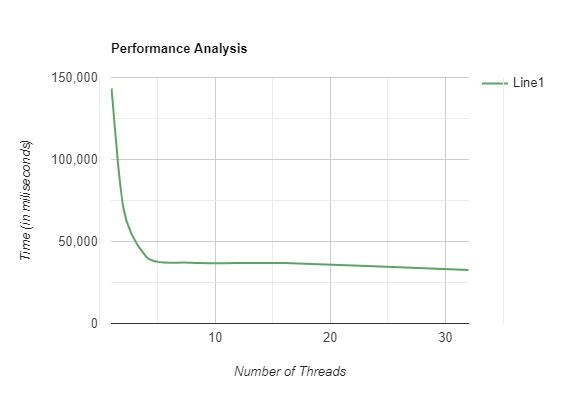

# Port Scanner 
## A basic [Port Scanner](https://vinitshahdeo.github.io/PortScanner/) using Python with an [Express](https://expressjs.com/) Server to test!

[](https://github.com/vinitshahdeo/PortScanner/blob/master/LICENSE) [](https://github.com/vinitshahdeo/PortScanner/) [](https://github.com/vinitshahdeo/PortScanner/commits/master)

With this port scanner, I just attempt to connect<sup>This is a form of "reconnaissance" for hackers and penetration testers</sup> at various ports, and do nothing else. If I'm able to connect to open ports, then I know at least the port is open.

## Pre-requisites

[](https://nodejs.org/) [](https://www.python.org/)

- **Python** `>= v2.7.0`
    - Install Python from [here](https://www.python.org/).

- **Node.js** `>= v0.10.0`
    - Install Node.js from [here](https://nodejs.org/).

## How to run?

- **Open terminal** and **type `npm install`**: This will install the dependencies ([Express](https://expressjs.com)).

- In the same terminal and **type `npm start`**: This will start multiple servers within the given range.

- **Open another terminal** and **type `python src/scanner.py`**: Enter `localhost` or `127.0.0.1`. It will scan all the ports and print the open ports.


> Note: You can enter remote host if you want to scan the ports for any remote host. Check the [DISCLAIMER.md](./DISCLAIMER.md) before doing this.

## Configuration :gear:

The servers are opened at multiple ports, you can change the low range and high range for the ports to be listened by the Express server.

```js
{
    "range": {
        "low": "1",
        "high": "8888"
    },
    "count": "10",
    "thread": { 
        "count": 8
    }
}
```

- `low`: _lowest port number (**inclusive**)_
- `high`: _highest port number (**exclusive**)_
- `count`: _total number of ports_
- `thread.count`: _total number of concurrent threads_

## Performance using threads :dart:

- `src/single/scanner.py`: Scanner without thread
- `src/scanner.py`: Scanner with multi threads

|Range(low-high)|`src/single/scanner.py` (in milliseconds)    |`src/scanner.py` (in milliseconds)   |
|---------------|----------------------------------|----------------------------------------|
|1-80           |143243                            |30862                                   |

> `CONST_NUM_THREADS` : 8

### Performance on the basis of number of threads :chart_with_downwards_trend:

Range of ports: `1-80`

|Number of threads|Execution time (in milliseconds)   | Compared Performances|
|-----------------|-----------------------------------|----------------------|
|2                |71627                              |50 % faster           |
|4                |40808                              |71.51 % faster        |
|8                |37003                              |74.17 % faster        |
|16               |36870                              |74.26 % faster        |
|32               |32674                              |77.19 % faster        |

#### Performance Analysis 



## Useful resources :books:

- [Express](https://expressjs.com/): Node.js web framework used for creating server. Check `server/index.js`
- [Socket](https://docs.python.org/3/library/socket.html):  Low-level networking interface in Python. Check `scanner.py`
- [Threading](https://docs.python.org/3/library/threading.html): Thread-based parallelism in python. Check `scanner_thread.py`

## Contributors :trophy:

[](https://github.com/vinitshahdeo/PortScanner/issues) [](https://github.com/vinitshahdeo/PortScanner/pulls)

- [@vinitshahdeo](https://github.com/vinitshahdeo/)
- [@Kashish121](https://github.com/Kashish121/)

[](https://github.com/vinitshahdeo/PortScanner/)[](https://github.com/vinitshahdeo/PortScanner/)[](https://github.com/vinitshahdeo/PortScanner/)[](https://github.com/vinitshahdeo/PortScanner/)[](https://github.com/vinitshahdeo/PortScanner/)[](https://github.com/vinitshahdeo/PortScanner/)[](https://github.com/vinitshahdeo/PortScanner/)[](https://github.com/vinitshahdeo/PortScanner/)

## Author

|                                                                                         <a href="https://fayz.in/stories/s/1522/0/?ckt_id=ZGL1ZGVk&title=story_of_vinit_shahdeo"></a>                                                                                         |
| :------------------------------------------------------------------------------------------------------------------------------------------------------------------------------------------------------------------------------------------------------------------------------------------------------------------------------------------: |
|                                                                                                                                        **[Vinit Shahdeo](https://fayz.in/stories/s/1522/0/?ckt_id=ZGL1ZGVk&title=story_of_vinit_shahdeo)**                                                                                                                                        |
| <a href="https://twitter.com/Vinit_Shahdeo"></a> <a href="https://www.facebook.com/vinit.shahdeo"></a> <a href="https://www.linkedin.com/in/vinitshahdeo/"></a> |

## TL;DR

Check out [this](https://gist.github.com/vinitshahdeo/92bf103f74a98cc55a447aa522bcdea9) gist if you're only looking for a **Python** script for **scanning ports**.

----
```javascript

if (_.isAwesome(thisRepo)) {
  thisRepo.star(); // thanks in advance :p
}

```
----

[](https://github.com/vinitshahdeo/)  [](https://twitter.com/Vinit_Shahdeo)

<sup>This repository is intended for individuals to test their own equipment for weak
 security, and the author(**@vinitshahdeo**) will take no responsibility if it is put to any other use. Check [DISCLAIMER.md](./DISCLAIMER.md)</sup>
 
[](https://github.com/vinitshahdeo/PortScanner/) [](https://github.com/vinitshahdeo/)
 
